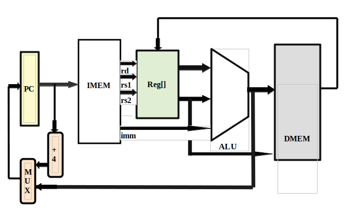

# RV32IM Single-Cycle CPU

## Overview

This repository contains the design and implementation of a single-cycle RV32IM CPU core. The RV32IM architecture is based on the RISC-V specification, supporting both integer (I) and multiplication/division (M) instruction sets. This project aims to provide a clear, educational, and extensible CPU design suitable for learning, experimentation, and hardware development.

## Features

- **RISC-V RV32IM Compliance:** Implements the full RV32I base instruction set along with the RV32M extension for integer multiplication and division.
- **Single-Cycle Architecture:** All instructions are executed in a single clock cycle, simplifying control logic and making the design ideal for educational purposes.
- **Modular Design:** Components such as the ALU, register file, control unit, and memory unit are well-encapsulated for ease of modification and reuse.
- **Readable Source Code:** Written with clarity and maintainability in mind, including detailed code comments and modular structure.
- **Testbench Included:** Contains a simple testbench for simulation and verification of CPU functionality.

## Directory Structure

```
├── src/                  # Source files for the CPU
│   ├── alu.v             # Arithmetic Logic Unit
│   ├── control_unit.v    # Control logic
│   ├── register_file.v   # Register file implementation
│   ├── cpu_top.v         # Top-level CPU module
│   └── ...               # Additional modules
├── testbench/            # Testbench and simulation files
│   ├── cpu_tb.v          # CPU testbench
│   └── ...               
├── docs/                 # Documentation and architecture diagrams
│   ├── architecture.png  # Block diagram of the CPU
│   └── instruction_set.md# Supported instructions
├── README.md             # This file
└── LICENSE               # License information
```

## Getting Started

### Prerequisites

- **Hardware Description Language (HDL) Toolchain:** Verilog/SystemVerilog simulator such as [Icarus Verilog](http://iverilog.icarus.com/), [ModelSim](https://www.intel.com/content/www/us/en/software/programmable/quartus-prime/model.html), or [Vivado](https://www.xilinx.com/products/design-tools/vivado.html).
- **RISC-V Documentation:** Familiarity with the [RISC-V ISA](https://riscv.org/technical/specifications/).

### Building & Simulating

1. **Clone the Repository**
   ```sh
   git clone https://github.com/bytesculptor097/rv32im-single-cycle-cpu.git
   cd rv32im-single-cycle-cpu
   ```

2. **Run Simulation**
   - Using Icarus Verilog:
     ```sh
     iverilog -o cpu_tb testbench/cpu_tb.v src/*.v
     vvp cpu_tb
     ```
   - Review the waveform using [GTKWave](http://gtkwave.sourceforge.net/) if desired.

3. **Modify and Extend**
   - The CPU is modular and easy to adapt. Add your own instructions or peripherals by extending the source modules.

## Supported Instructions

See [`docs/instruction_set.md`](docs/instruction_set.md) for a full list.

## Block Diagram



# VSDSquadronFM implementation
The VSDSquadron FPGA Mini (FM) is a compact and low-cost development board designed for FPGA prototyping and embedded system projects. This board provides a seamless hardware development experience with an integrated programmer, versatile GPIO access, and onboard memory, making it ideal for students, hobbyists, and developers exploring FPGA-based designs. [source](https://www.vlsisystemdesign.com/vsdsquadronfm/)
## Prerequisites

- Linux background or virtual box OSs (like Ubuntu)
- VSDSquadronFM

## Downloading the necessary building tools

#### Icestorm tools (icepack, icebox, iceprog, icetime, chip databases)
Install them by just running in the linux based terminal:-
```
git clone https://github.com/YosysHQ/icestorm.git icestorm
cd icestorm
make -j$(nproc)
sudo make install
```

#### NextPNR
```
git clone --recursive https://github.com/YosysHQ/nextpnr nextpnr
cd nextpnr
cmake -DARCH=ice40 -DCMAKE_INSTALL_PREFIX=/usr/local .
make -j$(nproc)
sudo make install
```
#### Yosys

```
 git clone https://github.com/YosysHQ/yosys.git yosys
 cd yosys
 make -j$(nproc)
 sudo make install
```
### Building the the binaries

Go to the `src` folder (Remember to clone this repository) and type:-
```
make build
```
*This will generate the binary file like top.bin, top.asc etc.*
### Flashing to the FPGA
Then right after building binaries, type:-
```
sudo make flash
```
*This will flash the binary files to the FPGA*

### Observing the output

After flashing type:-
```
sudo make terminal
```


## License

This project is licensed under the MIT License. See the [LICENSE](LICENSE) file for details.

## Author

- **bytesculptor097**

---

Feel free to reach out via [GitHub Issues](https://github.com/bytesculptor097/rv32im-single-cycle-cpu/issues) for questions, suggestions, or feedback.
